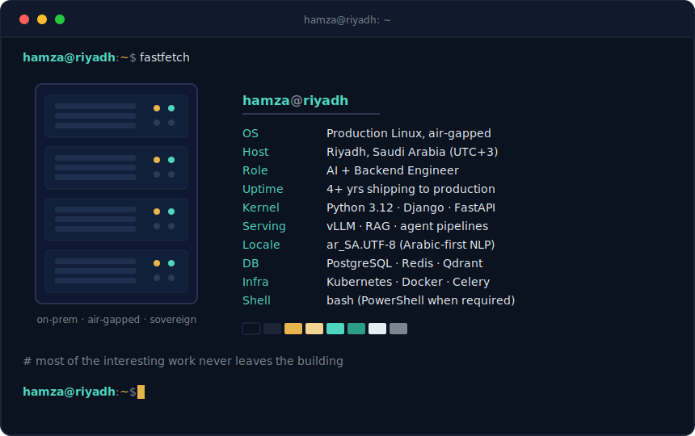

  

&nbsp;

&nbsp;

&nbsp;

  

## What I do

I build AI systems that run where the internet doesn't reach. Most of my work is on-premises and air-gapped: Arabic-first LLM products, speech analytics, and real-time tracking platforms for government and enterprise clients in Saudi Arabia. Backend to GPU, the whole stack: Django and FastAPI services, Celery pipelines, vLLM model serving, Kubernetes underneath.

## Shipped systems

Client work stays behind client firewalls, so here's the shape of it instead of the source.

| System | What it does | Scale |
|---|---|---|
| Arabic voice intelligence platform | 8-stage speech pipeline turning call-center audio into searchable analytics | ~400K calls a year, fully on-prem |
| National RFID monitoring platform | Real-time tag ingestion over MQTT, Celery processing, live ops dashboards | 9 sites, 36 fixed readers, 500+ tests, hard go-live date |
| Arabic social listening platform | Multi-source ingestion, deduplication, and analytics for public-sector monitoring | In production, CI/CD via GitHub Actions |

Currently in delivery: an air-gapped enterprise RAG layer with dual-lane vLLM serving, a 14B fast lane and a 72B heavy lane on dedicated GPU nodes.

## Public work

| Repo | What it is |
|---|---|
| [Gold-Trading-Assistant](https://github.com/HamzaAhmedWajeeh/Gold-Trading-Assistant) | XAUUSD signal agent with a macroeconomic veto layer. Llama 3.3 70B via Groq proposes the trade, macro data can overrule it. |

<!-- Add more rows to the table above as you open-source pieces of your work, e.g.: -->
<!-- | [LegalMind](https://github.com/HamzaAhmedWajeeh/LegalMind) | Multi-agent legal RAG over statute and case documents | -->
<!-- | [Lattice](https://github.com/HamzaAhmedWajeeh/Lattice) | Reference architecture for a sovereign AI/ML platform | -->

More coming as I carve the shareable parts out of private work.

## Stack

  

## Stats

  

  

<picture>
  <source media="(prefers-color-scheme: dark)" srcset="https://raw.githubusercontent.com/HamzaAhmedWajeeh/HamzaAhmedWajeeh/output/github-contribution-grid-snake-dark.svg" />
  
</picture>

## Find me

LinkedIn is where I write about sovereign AI and shipping in constrained environments: [linkedin.com/in/YOUR-LINKEDIN](https://www.linkedin.com/in/YOUR-LINKEDIN). Email works too: [you@example.com](mailto:you@example.com).

